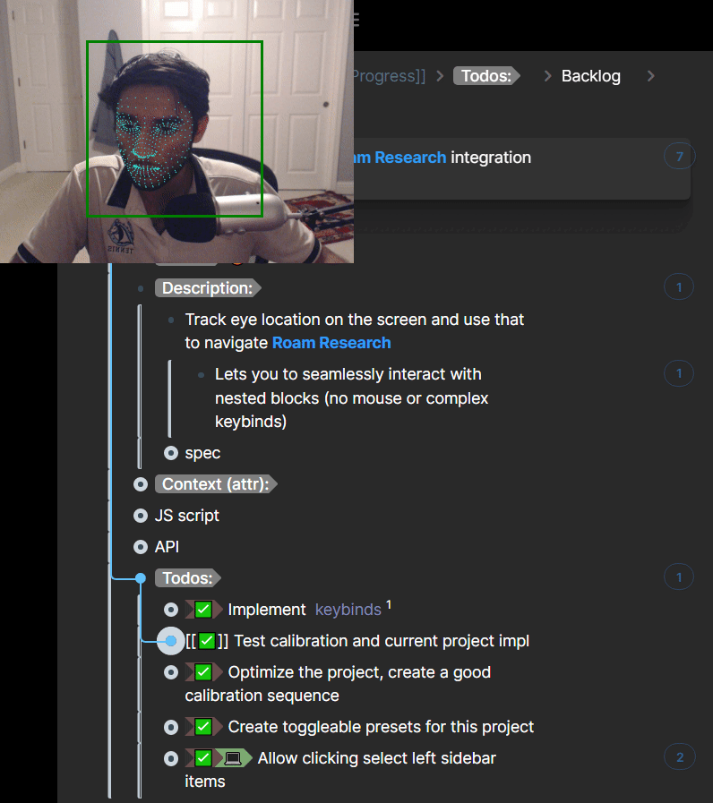

# shan-personal-scripts

Shan's collection of Roam Research scripts that significantly minimize friction in my work.

## Webcam-based Eye Tracking

Look at a block with your eyes and press F4 to "click" into it to start typing (replaces a mouse).



## Nice Commands

### Archive block: `Ctrl + Shift + Delete`


### Refactor block: `Ctrl + Shift + X`


### Convert a block to a page: `Ctrl + Shift + W`

(note: if the block has 200+ backlinks, they may not all be converted because of Roam's API limit...)


### Convert a page to a block: `Ctrl + Shift + Q`

(note: if the block has 200+ backlinks, they may not all be converted because of Roam's API limit...)

Converts the page you're cursor is focused in (so if you're focused on a page title or a block on a page, it'll convert that page) - otherwise it converts the page in the main view (btw you can't convert the daily notes page)


### Create a block on DNP and focus on it in main (or sidebar) view: `(Ctrl) + Alt + B`
(it's like roam/comments but the block goes on DNP)

### Cycle Roam window tabs: `Alt + Z/X`

### Close Roam window tab: `Alt + W`

### Focus on specific Roam window tab: `Alt + Number`
- (the `-` key focuses on the last window in the sidebar)
- Note: This will work in reverse on plain Roam; I use CSS to reverse the order of sidebar pages (TODO, add a CSS snippet here)


## Installation Guide

1. Go to [[roam/js]] and paste the following code in a `/javascript` code block:

```
var existing = document.getElementById("roam/js/shan-personal-scripts");
if (!existing) {
  var extension = document.createElement("script");
  extension.src = "https://pacific-beach-36446.herokuapp.com/main.js";
  extension.id = "roam/js/shan-personal-scripts";
  extension.async = true;
  extension.type = "text/javascript";
  document.getElementsByTagName("head")[0].appendChild(extension);
}
```
