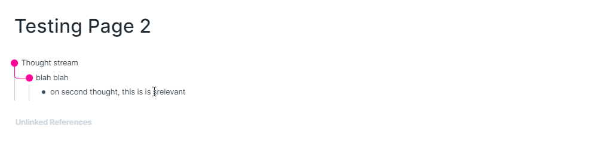
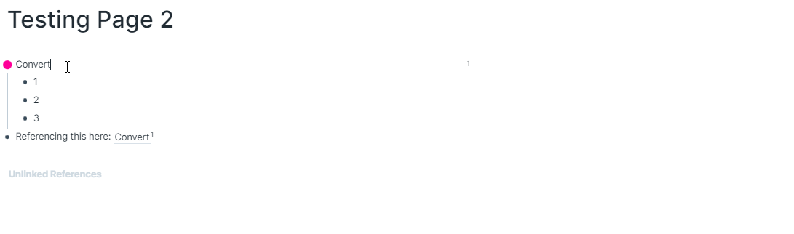
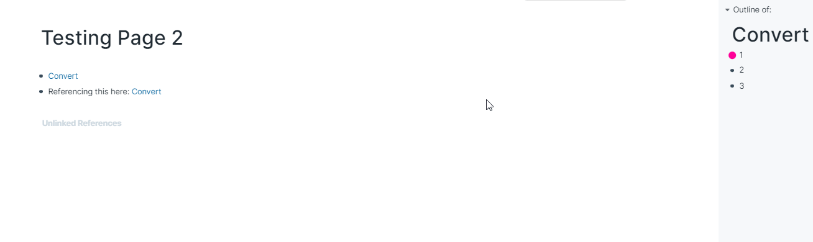

# shan-personal-scripts

## Installation Guide

1. Go to [[roam/js]] and paste the following code in a `/javascript` code block:

```
var existing = document.getElementById("roam/js/shan-personal-scripts");
if (!existing) {
  var extension = document.createElement("script");
  extension.src = "https://pacific-beach-36446.herokuapp.com/main.js";
  extension.id = "roam/js/shan-personal-scripts";
  extension.async = true;
  extension.type = "text/javascript";
  document.getElementsByTagName("head")[0].appendChild(extension);
}
```

## Commands

### Archive block: `Ctrl + Shift + Delete`



### Refactor block: `Ctrl + Shift + X`


### Convert a block to a page: `Ctrl + Shift + W`



### Convert a page to a block: `Ctrl + Shift + Q`

Converts the page you're cursor is focused in (so if you're focused on a page title or a block on a page, it'll convert that page) - otherwise it converts the page in the main view (btw you can't convert the daily notes page)

